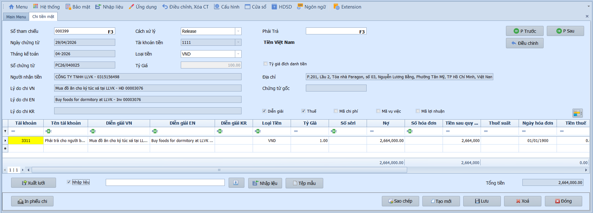
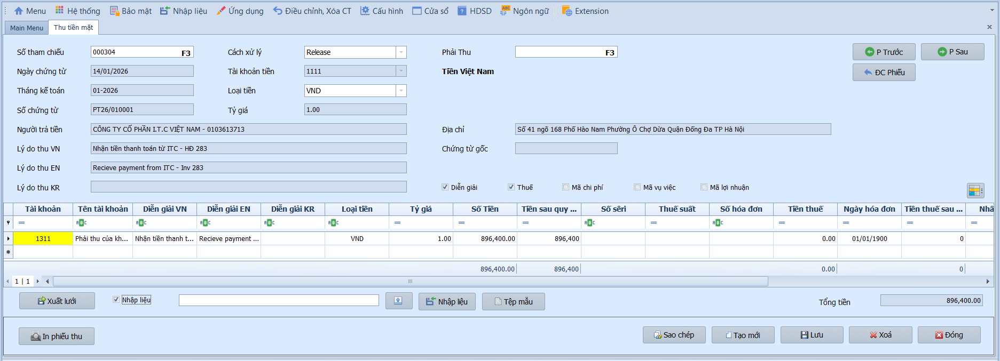

# 4.2 Phân mục nhập liệu

### Phiếu chi (Chi tiền mặt / Chi ngân hàng)

**Nghiệp vụ áp dụng:** Ghi nhận các khoản chi tiền mặt từ quỹ hoặc chi qua ngân hàng: chi thanh toán nhà cung cấp, chi lương, chi mua vật tư, chi tạm ứng, hoàn ứng. Hệ thống có hai màn riêng:
  - **Chi tiền mặt:** Chi từ quỹ tiền mặt (TK 111).
  - **Chi ngân hàng:** Chi qua tài khoản ngân hàng (TK 112).

> **Ví dụ nghiệp vụ:** Phiếu chi PC26/040025 ngày 29/04/2026 — chi tiền mặt thanh toán CÔNG TY TNHH LLVK mua đồ ăn cho ký túc xá theo HĐ 00003076, số tiền 2.664.000đ — Nợ TK 3311 / Có TK 1111.

Để nhập phiếu chi, người dùng thực hiện như sau:

1. Nhấn **Thêm mới** để tạo phiếu chi mới, hoặc nhấn **F3** tại **Số tham chiếu** để tìm phiếu cũ.
2. Nhập **Ngày chứng từ**, kiểm tra **Tháng kế toán** và **Số chứng từ**.
3. Chọn **Cách xử lý**. Nên giữ Chưa ghi sổ khi phiếu còn chờ kiểm tra, chuyển sang Ghi sổ khi đã duyệt chi và cần ghi sổ.
4. Chọn **Tài khoản tiền** phù hợp với màn hình: 111 cho chi tiền mặt, 112 cho chi ngân hàng.
5. Nhập **Người nhận tiền**, **Địa chỉ** và **Lý do chi VN / EN / KR**.
6. Nếu chi để thanh toán công nợ AP, nhấn **F3** tại **Phải trả** để liên kết chứng từ gốc.
7. Nhập các dòng chi tiết: tài khoản đối ứng, số tiền, thông tin hóa đơn/thuế, mã nhân viên hoặc mã KH/NCC nếu cần theo dõi.
8. Kiểm tra **Tổng tiền** và nhấn **Lưu**; sau đó in phiếu chi hoặc ghi sổ theo quy trình.

- **Thông tin chung:**
  - Số tham chiếu: Mặc định `<NEW>` khi thêm mới; nhấn **F3** để tìm chứng từ cũ.
  - Ngày chứng từ / Tháng kế toán / Số chứng từ: Hệ thống tự động hiển thị theo ngày hiện tại và quy tắc cấu hình.
  - Người nhận tiền / Địa chỉ: Nhập tên và địa chỉ đơn vị/cá nhân nhận tiền.
  - Tài khoản tiền / Loại tiền / Tỷ giá: Chọn tài khoản tiền mặt/tiền gửi và loại tiền tệ (mặc định VND).
  - Tỷ giá đích danh: Để trống để hệ thống tự tính tỷ giá xuất quỹ; tích chọn nếu muốn nhập thủ công tỷ giá cụ thể.
  - Phải trả / Chứng từ gốc: Nhấn **F3** để liên kết với chứng từ AP liên quan.
  - Lý do chi VN / EN / KR: Nhập diễn giải lý do chi theo từng ngôn ngữ.

- **Lưới chi tiết:**
  - Tài khoản đối ứng / Diễn giải: Nhập TK đối ứng và nội dung từng dòng định khoản.
  - Thuế suất / Tiền thuế: Chọn % thuế — hệ thống tự động tính tiền thuế từng dòng.
  - Số HĐ / Số seri / Mẫu HĐ / Ngày HĐ: Nhập thông tin hóa đơn GTGT để lên bảng kê thuế.
  - Mã NV / Mã KH / NCC: Nhập mã nhân viên, khách hàng hoặc nhà cung cấp liên quan.

- **Các nút chức năng:**
  - P. trước / P. sau: Duyệt chứng từ liền kề.
  - Xuất lưới / Nhập liệu: Xuất dữ liệu ra Excel hoặc nhập dữ liệu từ file ngoài.
  - Tệp mẫu: Xuất mẫu Excel để nhập dữ liệu chi tiết trước khi nhập dữ liệu.
  - In chứng từ: In hoặc xuất PDF theo mẫu.
  - Lưu / Sao chép / Thêm mới / Xóa / Đóng: Các thao tác tiêu chuẩn.

- **Lưu ý khi thao tác:**
  - Với chi tiền mặt, tài khoản tiền phải là tài khoản 111; với chi ngân hàng, dùng tài khoản 112 theo tài khoản ngân hàng thực chi.
  - Khi liên kết chứng từ AP, nhập đúng nhà cung cấp và số tiền chi để công nợ phải trả giảm đúng hóa đơn.
  - Nếu dòng chi có VAT, cần nhập mã thuế và thông tin hóa đơn để lên bảng kê thuế đầu vào.
  - Với tài khoản công nợ, cần nhập mã khách hàng/nhà cung cấp tương ứng; với tài khoản quản trị, nhập đủ mã chi phí/vụ việc/lợi nhuận nếu hệ thống yêu cầu.
  - Chứng từ ở trạng thái Đã ghi sổ muốn sửa cần bỏ ghi sổ hoặc lập chứng từ điều chỉnh theo quy trình kiểm soát.

> **Hệ thống tự kiểm tra khi Lưu:**
> - Số chứng từ bắt buộc nhập, 4 ký tự cuối phải là số và không được trùng trong cùng kỳ.
> - Ngày chứng từ phải thuộc đúng tháng kế toán và kỳ kế toán chưa đóng.
> - Tài khoản tiền, loại tiền và tỷ giá là bắt buộc; tỷ giá phải lớn hơn 0.
> - Phải có ít nhất một dòng chi tiết; tài khoản đối ứng phải hợp lệ trong phân hệ tiền.
> - Số tiền trên dòng không được âm.
> - Nếu có tiền thuế và bật theo dõi thuế, dòng chi tiết phải có mã thuế.
> - Nếu tài khoản yêu cầu mã đối tượng hoặc mã phân bổ, hệ thống sẽ yêu cầu nhập trước khi lưu.

> **Lưu ý:** Sau khi Lưu, phiếu chi ở trạng thái Chưa ghi sổ. Chuyển sang Ghi sổ để phản ánh sang Sổ Cái GL, hoặc dùng **Ghi sổ nhiều chứng từ** để ghi sổ hàng loạt.

---

### Phiếu thu (Thu tiền mặt / Thu ngân hàng)

**Nghiệp vụ áp dụng:** Ghi nhận các khoản tiền nhận được từ khách hàng hoặc các nguồn thu khác: thu tiền bán hàng, thu hồi tạm ứng, thu lãi ngân hàng. Hệ thống có hai màn riêng:
  - **Thu tiền mặt:** Thu vào quỹ tiền mặt (TK 111).
  - **Thu ngân hàng:** Thu qua tài khoản ngân hàng (TK 112).

> **Ví dụ nghiệp vụ:** Phiếu thu PT26/010001 ngày 14/01/2026 — thu tiền mặt từ CÔNG TY CỔ PHẦN I.T.C VIỆT NAM thanh toán theo HĐ 283, số tiền 896.400đ — Nợ TK 1111 / Có TK 1311.

Để nhập phiếu thu, người dùng thực hiện như sau:

1. Nhấn **Thêm mới** để tạo phiếu thu mới, hoặc nhấn **F3** tại **Số tham chiếu** để tìm phiếu cũ.
2. Nhập **Ngày chứng từ**, kiểm tra **Tháng kế toán** và **Số chứng từ**.
3. Chọn **Cách xử lý**. Nên giữ Chưa ghi sổ khi phiếu còn chờ đối chiếu, chuyển sang Ghi sổ khi đã xác nhận thu tiền.
4. Chọn **Tài khoản tiền** phù hợp với màn hình: 111 cho thu tiền mặt, 112 cho thu ngân hàng.
5. Nhập **Người trả tiền**, **Địa chỉ** và **Lý do thu VN / EN / KR**.
6. Nếu thu tiền cho hóa đơn AR, nhấn **F3** tại **Phải thu** để liên kết chứng từ gốc.
7. Nhập các dòng chi tiết: tài khoản đối ứng, số tiền, thông tin hóa đơn/thuế, mã nhân viên hoặc mã KH/NCC nếu cần theo dõi.
8. Kiểm tra **Tổng tiền** và nhấn **Lưu**; sau đó in phiếu thu hoặc ghi sổ theo quy trình.

- **Thông tin chung:**
  - Số tham chiếu: Mặc định `<NEW>` khi thêm mới; nhấn **F3** để tìm chứng từ cũ.
  - Ngày chứng từ / Tháng kế toán / Số chứng từ: Hệ thống tự động hiển thị theo ngày hiện tại và quy tắc cấu hình.
  - Người trả tiền / Địa chỉ: Nhập tên và địa chỉ đơn vị/cá nhân trả tiền.
  - Tài khoản tiền / Loại tiền / Tỷ giá: Chọn tài khoản tiền mặt/tiền gửi và loại tiền tệ (mặc định VND).
  - Phải thu / Chứng từ gốc: Nhấn **F3** để liên kết với chứng từ AR liên quan.
  - Lý do thu VN / EN / KR: Nhập diễn giải lý do thu theo từng ngôn ngữ.

- **Lưới chi tiết:**
  - Tài khoản đối ứng / Diễn giải: Nhập TK đối ứng và nội dung từng dòng định khoản.
  - Thuế suất / Tiền thuế: Chọn % thuế — hệ thống tự động tính tiền thuế từng dòng.
  - Số HĐ / Số seri / Mẫu HĐ / Ngày HĐ: Nhập thông tin hóa đơn GTGT để lên bảng kê thuế.
  - Mã NV / Mã KH / NCC: Nhập mã nhân viên, khách hàng hoặc nhà cung cấp liên quan.

- **Các nút chức năng:**
  - P. trước / P. sau: Duyệt chứng từ liền kề.
  - Xuất lưới / Nhập liệu: Xuất dữ liệu ra Excel hoặc nhập dữ liệu từ file ngoài.
  - Tệp mẫu: Xuất mẫu Excel để nhập dữ liệu chi tiết trước khi nhập dữ liệu.
  - In chứng từ: In hoặc xuất PDF theo mẫu.
  - Lưu / Sao chép / Thêm mới / Xóa / Đóng: Các thao tác tiêu chuẩn.

- **Lưu ý khi thao tác:**
  - Với thu tiền mặt, tài khoản tiền phải là tài khoản 111; với thu ngân hàng, dùng tài khoản 112 theo tài khoản ngân hàng thực nhận.
  - Khi liên kết chứng từ AR, số tiền thu không được vượt số tiền còn phải thu của chứng từ gốc.
  - Nếu dòng thu có VAT, cần nhập mã thuế và thông tin hóa đơn để lên bảng kê thuế đúng.
  - Với tài khoản công nợ, cần nhập mã khách hàng/nhà cung cấp tương ứng; với tài khoản quản trị, nhập đủ mã chi phí/vụ việc/lợi nhuận nếu hệ thống yêu cầu.
  - Chứng từ ở trạng thái Đã ghi sổ muốn sửa cần bỏ ghi sổ hoặc lập chứng từ điều chỉnh theo quy trình kiểm soát.

> **Hệ thống tự kiểm tra khi Lưu:**
> - Số chứng từ bắt buộc nhập, 4 ký tự cuối phải là số và không được trùng trong cùng kỳ.
> - Ngày chứng từ phải thuộc đúng tháng kế toán và kỳ kế toán chưa đóng.
> - Tài khoản tiền, loại tiền và tỷ giá là bắt buộc; tỷ giá phải lớn hơn 0.
> - Phải có ít nhất một dòng thu; tài khoản đối ứng phải hợp lệ trong phân hệ tiền.
> - Số tiền trên dòng không được âm.
> - Nếu có tiền thuế và bật theo dõi thuế, dòng chi tiết phải có mã thuế.
> - Nếu liên kết chứng từ AR, hệ thống kiểm tra không cho thu vượt số phải thu còn lại theo từng loại tiền.
> - Nếu tài khoản yêu cầu mã đối tượng hoặc mã phân bổ, hệ thống sẽ yêu cầu nhập trước khi lưu.

> **Lưu ý:** Sau khi Lưu, phiếu thu ở trạng thái Chưa ghi sổ. Chuyển sang Ghi sổ để phản ánh sang Sổ Cái GL.
